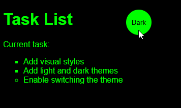

# simple-website

Um projeto simples desenvolvido para praticar os fundamentos do desenvolvimento web utilizando **HTML**, **CSS** e **JavaScript**.

## Preview

<p align="center">
  
</p>

---

## Sobre o projeto

O **simple-website** é uma página web criada com o objetivo de colocar em prática conceitos básicos de desenvolvimento front-end.

O projeto apresenta uma lista de tarefas e um botão que permite alternar entre os temas claro e escuro, demonstrando a manipulação do DOM através do JavaScript e a utilização de variáveis CSS para estilização dinâmica.

---

## Funcionalidades

- Exibição de uma lista de tarefas;
- Alternância entre tema claro e escuro;
- Alteração dinâmica do texto do botão;
- Uso de variáveis CSS para gerenciamento dos temas.

---

## Tecnologias utilizadas

- HTML5
- CSS3
- JavaScript (ES6)

---

## Estrutura do projeto

```
simple-website/
│
├── images/
│   └── simple-website-preview.gif
│
├── app.js
├── index.html
├── main.css
└── README.md
```

---

## Conceitos praticados

Durante o desenvolvimento deste projeto foram praticados os seguintes conceitos:

- Estrutura básica de uma página HTML;
- Organização de arquivos em um projeto web;
- Seleção de elementos com JavaScript;
- Manipulação de classes com `classList.toggle()`;
- Eventos com `addEventListener()`;
- Manipulação do DOM;
- Variáveis CSS (`:root`);
- Separação entre estrutura, estilo e comportamento da aplicação.

---

## Como executar

1. Clone este repositório:

```bash
git clone https://github.com/gabrielziglio07/simple-website.git
```

2. Entre na pasta do projeto:

```bash
cd simple-website
```

3. Abra o arquivo `index.html` no navegador.

Ou utilize uma extensão como o **Live Server** no Visual Studio Code para executar o projeto.

---

## Sobre este repositório

Este projeto faz parte da minha jornada de aprendizado em **Análise e Desenvolvimento de Sistemas**.

Meu objetivo é desenvolver projetos cada vez mais completos para consolidar conhecimentos em desenvolvimento web e construir um portfólio que demonstre minha evolução como programador.

---

## Próximos passos

Algumas melhorias que pretendo implementar futuramente:

- [ ] Layout responsivo;
- [ ] Animação na troca de temas;
- [ ] Adicionar novas tarefas dinamicamente;
- [ ] Remover tarefas;
- [ ] Salvar tarefas utilizando Local Storage.

---

## Licença

Este projeto foi desenvolvido exclusivamente para fins de estudo e aprendizado.
